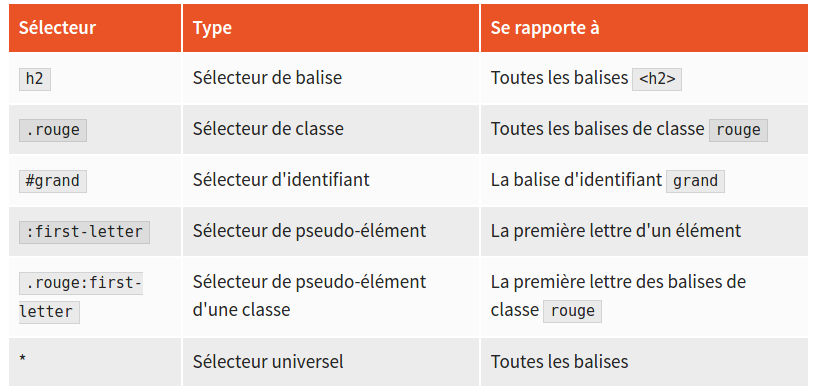

**Balise**

Aussi appelée élément ou tag, c'est l'entité de base du langage HTML. Les balises sont toujours encadrées par les caractères < et >. Par exemple <html> ou encore <body>. Les balises ouvertes doivent être fermées avec une balise fermante. Par exemple </html> ou encore </body>. Certaines balises peuvent être à la fois ouvrantes et fermantes. Dans ce cas, le caractère / apparaît avant le signe > de fin de balise. Par exemple, .

**Attribut**

Outre leur nom, certaines balises HTML peuvent recevoir une ou plusieurs informations complémentaires. Ces informations sont des attributs. Toujours spécifiés dans la balise ouvrante, ils sont suivis d'un signe = et d'une valeur entre guillemets. Lorsqu'une balise contient plusieurs attributs, ils sont séparés par des espaces. La balise  du code  contient trois attributs : src, alt et id.

**Block**

Les balises HTML de type block sont affichées sur des lignes successives. Par exemple, si l'on définit deux balises 
 dans un document HTML, elles seront affichées l'une en dessous de l'autre. Les balises de type block peuvent être dimensionnées, et donc occuper un espace bien défini (hauteur et largeur) dans un document.

**Inline**

Les balises HTML de type inline sont affichées les unes à la suite des autres. Par exemple, si l'on définit deux balises  dans un document HTML, elles seront affichées sur une même ligne. Les balises de type inline ne peuvent pas être dimensionnées. Elles occupent un espace qui dépend de leur contenu.

**Inline-block**

C'est un mélange des types inline et block. Si on définit deux balises de type inline-block dans un document HTML, elles seront affichées l'une à la suite de l'autre (c'est le comportement des balises inline). Leur taille (largeur et hauteur) pourra également être définie (c'est le comportement des balises block).

**Feuille de styles**

C'est un document qui rassemble un ou plusieurs styles CSS qui définissent la mise en forme d'un document. Si la feuille de styles est interne à un document, les différents styles doivent être définis dans l'en-tête du document, entre les balises . Si la feuille de styles est externe, vous devez définir les styles dans un fichier d'extension .css et y faire référence dans l'en-tête du document en utilisant une balise <link rel="stylesheet" type="text/css" href="feuille-de-styles.css" />. Ici, la feuille de styles a pour nom feuille-de-styles.css.

**W3C**

Le World Wide Web Consortium (W3C), est un organisme de standardisation à but non lucratif, chargé de promouvoir la compatibilité des technologies du World Wide Web telles que HTML, XHTML, XML, RDF, CSS, PNG, SVG et SOAP.

**DOM**

Le Document Object Model est une structure de données qui représente un document HTML comme une arborescence. La racine de cet arbre est un nœud nommé document qui correspond grossièrement à la balise <html>. Tout aussi grossièrement, les balises HTML définies dans la page Web correspondent aux nœuds de l'arbre DOM et en constituent la structure. Le langage jQuery est en mesure d'interroger le DOM pour connaître les caractéristiques (attributs et valeurs HTML, propriétés et valeurs CSS) des balises qui constituent un document HTML, mais aussi de modifier ces éléments pour changer l'allure et/ou le contenu du document.

**DTD**

Le Document TYPE Declaration fait référence à la balise <!DOCTYPE>. Cette dernière doit apparaître en tête des documents HTML. Elle indique au navigateur les règles d'écriture utilisées dans le document. 
